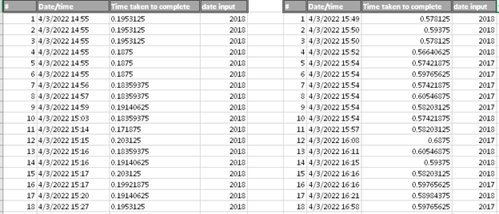
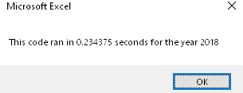
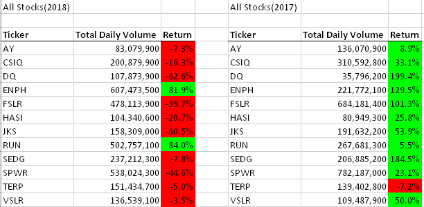

# VBA-of-Wall-Street
---
#Overview of Project
---
Our recent client Steve originally asked for a workbook that would be of use to determining the perfect stock to purchase for his Mom and dad. Now he would like the code to be upgraded to analyze an entire stock market over a vast of a few years. 

---
  While going through the module there was a section that asked me to try it on my own. In the end I ended up making a program that fulfilled the new request of the client. So instead, I went back to 2.3.3 and copied paste the code while also coping code from mine into it such as formatting and inputbox(). I also used ‘Ctrl + F’ to find “All Stock Analysis” and replace it with “All Stock Analysis (mine) to make a separate worksheet” (making Worksheets("All Stock Analysis(mine)").Activate).  

---
#Results
---
While testing out run times I found it Tedious to screen shot every pop-up screen quickly making a program that will save the values for me. 

---

---
The first table shows my code while the second shows the speed of the module’s code. While looking at the tables separately we can see that the times that the time past are relatively the same. But just to make things better we can grab the average of each table.

. While 

---
mine does not. I used the original code that only went through ‘dq’ and made some altercations. The altercations being that it will go through all tickers no just ‘dq’. I’ve done this by creating a new variable ‘Ticker’ and grabbing the first ticker then having the if statements determine if the next value was still ‘Ticker’. If it wasn’t it would print the code on the table accordingly, grabs the next new ‘ticker’ and adds 1 to a new variable ‘b’(which is just a place holder so data won’t be over lapped). 

---

---
Now the important question “what can we tell Steve about data?”. We can see that ENPH continued to increase after 2017. We should also say not to loo over run cause even tho it didn’t do great in 2017 it did even better in 2018. Of course, in the end he is the professional in finance so I’m sure he will come to his own conclusions

#summary
---
In the end this code ran surprisingly faster than the modules. I assumed the module would run faster cause the tickers were already announced. But not only did my code ended up being faster, it ended up being smaller as well. The only problem with the code is if the data set wasn’t in order by ticker and date. But this can be fixed by manually filtering the data and date. I’m sure there is also something in VBA that can do this as well. 

---

